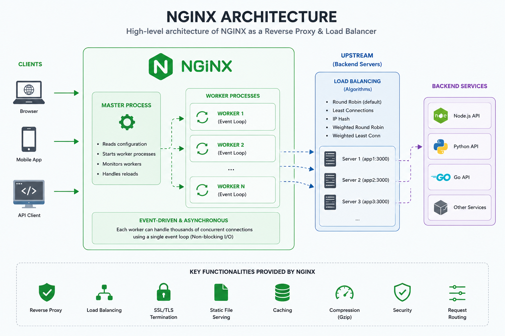
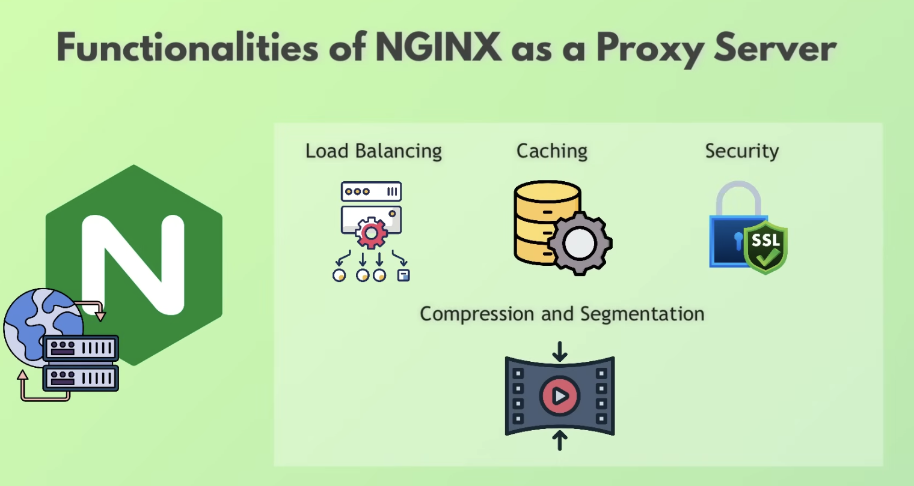
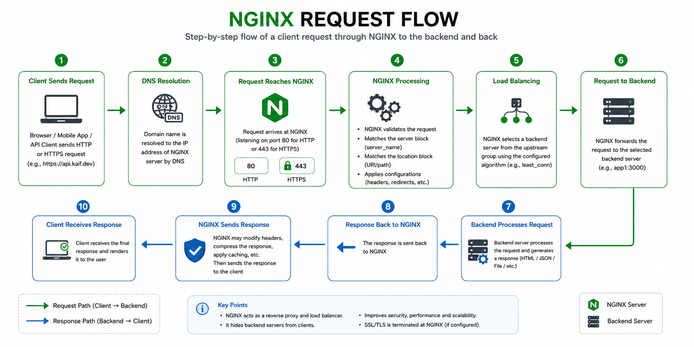
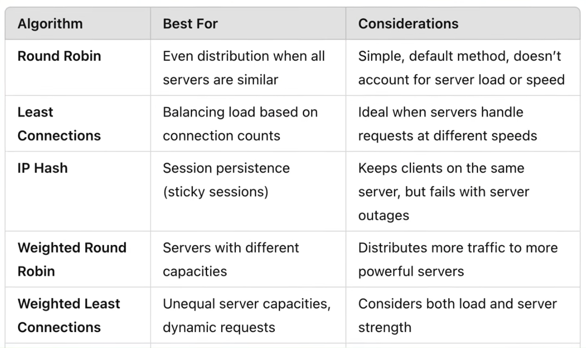

# Nginx Reference

A structured reference for learning **NGINX** from the ground up.

This repository covers everything from the core architecture to production-ready reverse proxy configurations.

---

# What is NGINX?

NGINX (pronounced **Engine-X**) is a high-performance web server that can also act as a:

- Web Server
- Reverse Proxy
- Load Balancer
- HTTP Cache
- SSL/TLS Terminator
- API Gateway (basic)
- Kubernetes Ingress Controller

Unlike traditional web servers that create a thread or process for every client, NGINX uses an **event-driven, asynchronous architecture**, allowing a small number of worker processes to handle thousands of concurrent connections efficiently.

---

# Architecture



At a high level:

1. Clients send requests to NGINX.
2. The **Master Process** manages worker processes.
3. **Worker Processes** handle thousands of client connections using an event loop.
4. Requests are forwarded to an **Upstream** (backend server group).
5. The selected backend processes the request and returns the response through NGINX.

---

# Functionalities



NGINX is commonly used for:

- Reverse Proxy
- Load Balancing
- SSL/TLS Termination
- Static File Hosting
- Caching
- Compression (Gzip)
- Request Routing
- Security

---

# Request Flow



Typical request lifecycle:

```text
Client
   │
   ▼
NGINX
   │
   ▼
Server Block
   │
   ▼
Location Block
   │
   ▼
Upstream
   │
   ▼
Backend Server
   │
   ▼
NGINX
   │
   ▼
Client
```

Instead of clients communicating directly with backend servers, every request first reaches **NGINX**, which decides where to forward it.

---

# Why use NGINX?

Without NGINX

```text
Browser
    │
    ├────────► Backend 1
    ├────────► Backend 2
    └────────► Backend 3
```

Problems

- No load balancing
- No centralized SSL/TLS
- No request routing
- No caching
- Backend servers are directly exposed
- Harder to scale

---

With NGINX

```text
Browser
      │
      ▼
    NGINX
      │
 ┌────┴────┐
 ▼    ▼    ▼
API1 API2 API3
```

Benefits

- Single entry point
- Reverse proxy
- Load balancing
- HTTPS termination
- Better security
- Centralized routing
- Easier scaling
- Backend servers remain hidden

---

# Load Balancing Algorithms



NGINX supports multiple load balancing strategies.

| Algorithm | Best Used For |
|-----------|---------------|
| Round Robin *(default)* | Servers with similar capacity |
| Least Connections | Servers processing requests at different speeds |
| IP Hash | Sticky sessions / Session persistence |
| Weighted Round Robin | Servers with different hardware capacities |
| Weighted Least Connections | Dynamic workloads with unequal server capacity |

---

# Repository Structure

```text
.
├── README.md
├── COMMANDS.md
├── nginx-reference.conf
│
├── images
│   ├── architecture.png
│   ├── request-flow.png
│   ├── functionalities.png
│   └── algorithms.png
│
└── project
    └── nginx-cert
```

---

# What's Covered

- NGINX Architecture
- Directives & Contexts
- Worker Processes
- Worker Connections
- MIME Types
- Upstreams
- Reverse Proxy
- Proxy Headers
- Load Balancing
- SSL/TLS
- HTTP → HTTPS Redirect
- Docker Networking
- Production Best Practices

---

# Prerequisites

Before using this repository you should already understand:

- Linux
- Docker
- Docker Compose
- HTTP Basics

---
